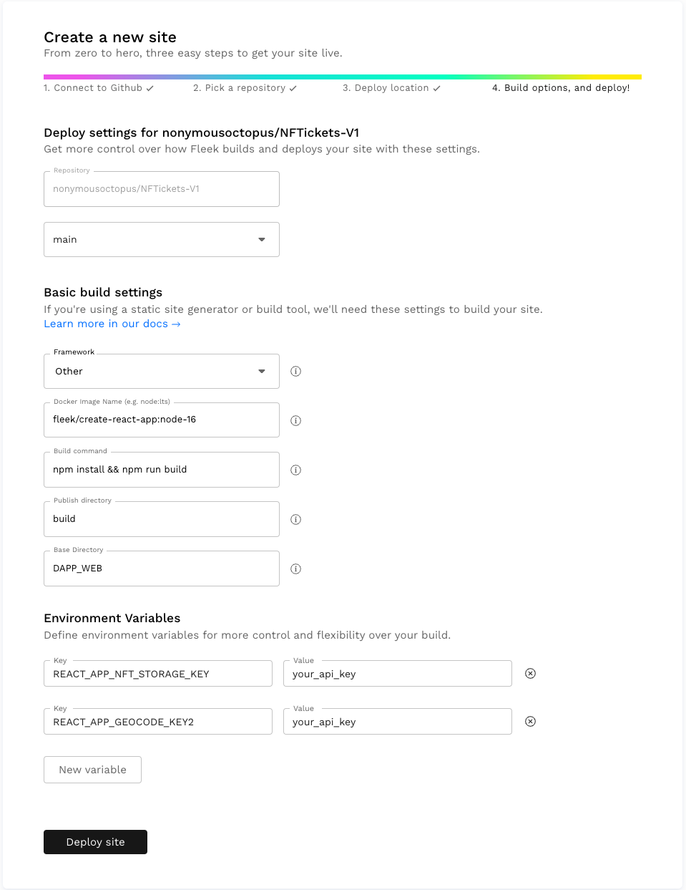

# NFTickets - dapp web

This project uses the React JS library. Please see [reactjs.org](https://reactjs.org/) for full documentation.

## Instructions

Navigate to the DAPP_WEB directory:

```
cd DAPP_WEB
```

Install the dependencies:

```
npm install
```

Create a ```.env``` file as per the ```.env.example``` file and populate it with your keys.

To obtain the ```REACT_APP_NFT_STORAGE_KEY``` visit [nft.storage](https://nft.storage/)

To obtain the ```REACT_APP_GEOCODE_KEY``` [click here](https://developers.google.com/maps/documentation/geocoding/get-api-key)

### Local testing

Test locally:

```
npm start
```

Open [http://localhost:3000](http://localhost:3000) to view it in your browser.

## deploying on IPFS via Fleek

If you choose to deploy this on IPFS via [fleek.co](https://fleek.co/), register and deploy your github repo using the following settings:



### Deployment settings

| Setting                    | Value                            |
| -------------------------- | -------------------------------- |
| Repository                 | github_username/NFTickets-V1     |
| Framework                  | Create React App                 |
| Docker Image Name          | fleek/create-react-app:node-16   |
| Build command              | npm install && npm run build     |
| Publish directory          | build                            |
| Base directory             | DAPP_WEB                         |

### Enviornment variabls

| Enviornment Variables      | Value                            |
| -------------------------- | -------------------------------- |
| REACT_APP_NFT_STORAGE_KEY  | your_api_key                     |
| REACT_APP_GEOCODE_KEY2     | your_api_key                     |

Once you have all the above filled in, click **Deploy site**

## Mobile app deployment

You can now set up and deploy your mobile app.

Navigate out of this directory to proceed:

```
cd ..
```

[Click here for proceed with setting up and deploying the mobile app](./../DAPP_MOBILE/README.md)